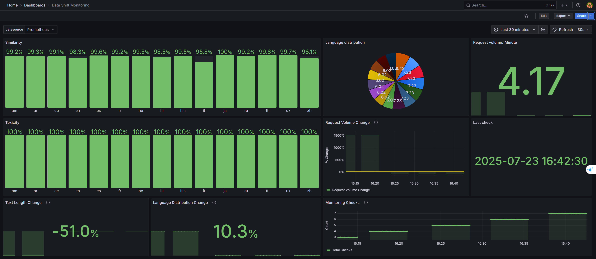

# 🚀 MLOps Production Pipeline for Text Detoxification

A comprehensive production-ready MLOps solution for deploying Multilingual Text Detoxification models (TextDetox 2025) on Google Cloud Platform. This project demonstrates enterprise-grade deployment practices with infrastructure as code, containerization, monitoring, and CI/CD automation.

> **Competition**: [TextDetox 2025 Challenge](https://codalab.lisn.upsaclay.fr/competitions/22396#participate)

## 🏗️ Architecture Overview

- **Infrastructure**: Terraform-managed GCP GPU instances with auto-scaling capabilities
- **Runtime**: Docker containerization with GPU driver optimization
- **Serving**: vLLM + FastAPI high-performance inference endpoint
- **Monitoring**: Grafana + Prometheus real-time observability stack
- **Logging**: Google Cloud Logging with BigQuery integration
- **Security**: Middleware-based prompt injection protection

## ✨ Key Features

### 🎯 **Production-Ready Deployment**
- Automated GCP GPU instance provisioning with Terraform
- Docker containerization with optimized GPU driver installation
- Zero-downtime deployment with health checks

### 🔥 **High-Performance Inference**
- vLLM serving engine for maximum throughput
- FastAPI endpoints with async request handling
- LoRA adapter support for multi-model serving

### 📊 **Enterprise Monitoring & Observability**
- Real-time Grafana dashboards for system and model metrics
- Prometheus metrics collection and alerting
- Google Cloud Logging with automated BigQuery export
- Performance analytics and bottleneck detection

### 🛡️ **Security & Reliability**
- Prompt injection protection middleware
- Secure credential management
- Infrastructure hardening best practices

### 🔄 **DevOps Automation**
- CI/CD pipeline for automated testing and deployment
- Infrastructure as Code (IaC) with Terraform
- Automated monitoring and alerting for:
  - System performance degradation
  - Data distribution shifts
  - Model performance drift

## 📋 Prerequisites

- Google Cloud Platform account with billing enabled
- Terraform >= 1.0
- Docker and Docker Compose
- GCP service account with appropriate permissions

## 🚀 Quick Start

### 1. Clone & Setup
```bash
git clone https://github.com/ducanhdt/detoxify_depolyment.git
cd detoxify_depolyment
```

### 2. Configure GCP Authentication
Place your Google Cloud service account credentials in `credentials.json` at the project root.

### 3. Deploy Infrastructure
```bash
bash start_service.sh
```
⏱️ **Deployment time**: ~10 minutes for complete infrastructure setup

### 4. Monitor Your Deployment
Access your Grafana dashboard to monitor real-time metrics and performance.



## 🛠️ Technical Stack

| Component | Technology | Purpose |
|-----------|------------|---------|
| Infrastructure | Terraform | Cloud resource provisioning |
| Container Runtime | Docker + Docker Compose | Service orchestration |
| ML Serving | vLLM | High-performance model inference |
| API Framework | FastAPI | RESTful API endpoints |
| Monitoring | Grafana + Prometheus | Metrics visualization & alerting |
| Logging | Google Cloud Logging | Centralized log management |
| Data Warehouse | BigQuery | Log analytics & insights |

## 📈 Development Milestones

### 🏗️ **Infrastructure Foundation** (July 8, 2025)
- Terraform automation for GCP GPU instance provisioning
- Docker containerization with GPU driver optimization
- SSH key management and secure access configuration

### 🔧 **Core Services Development** (July 9-10, 2025)
- FastAPI inference endpoint with vLLM integration
- LoRA adapter configuration for multi-model serving
- Security middleware implementation for prompt protection
- Google Cloud Logging integration with BigQuery export

### 📊 **Monitoring & Observability** (July 11, 2025)
- Grafana dashboard creation for real-time metrics
- Prometheus configuration for system monitoring
- Docker containerization of monitoring stack

### 📊 **Automated Evaluate Model Performance** (July 11, 2025)
- Detect data drift by input text length and language distribution
- Automated evaluation scripts for model performance hourly
- Grafana dashboard creation for those metrics

## 🔮 Roadmap

- **Auto-retraining Pipeline**: Automated model retraining on data drift detection
- **Model Versioning**: A/B testing framework with model version management
- **Multi-cloud Support**: Extend deployment to AWS and Azure
- **Advanced Security**: Enhanced threat detection and response

---
